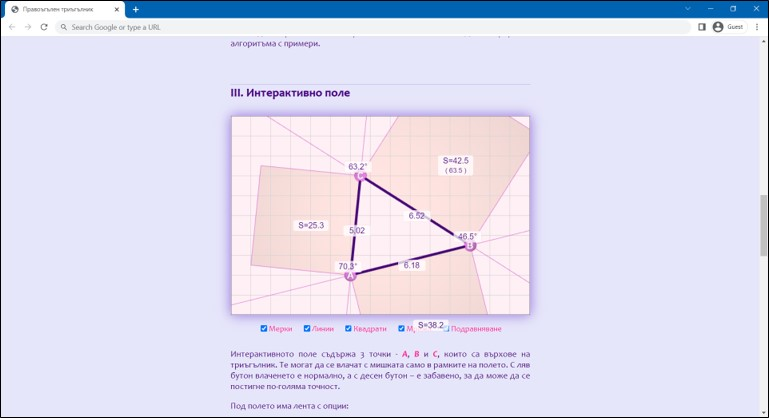
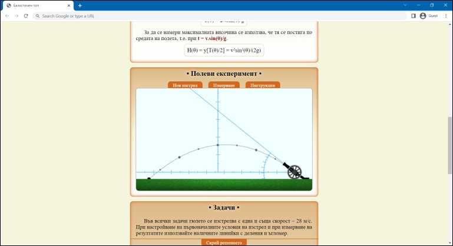
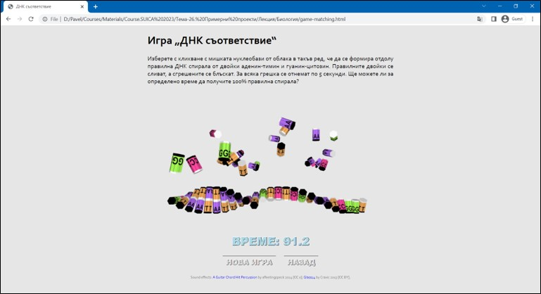

# Примери

**Геометрия** Правоъгълен триъгълник

[<kbd></kbd>](LectureBG/Геометрия/index.html)

**Физика** Балистичен топ

[<kbd></kbd>](LectureBG/Физика/index.html)
**Биология** ДНК Игри

[<kbd></kbd>](LectureBG/Биология/index.html)

