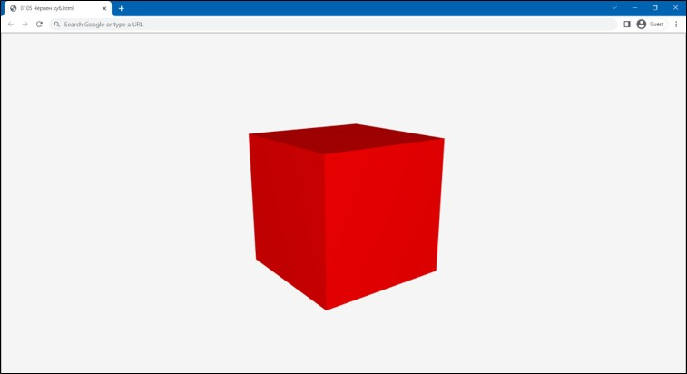

### Съдържание
- [Тема №1 &ndash; Въведение](#тема-№1--въведение)
- [Тема №2 &ndash; HTML](#тема-№1--html)

## Тема №1 &ndash; Въведение

#### Задачи

**0105** Червен куб

[<kbd></kbd>](01/ExerciseBG/0105-Червен-куб.html)

## Тема №2 &ndash; HTML

#### Примери

**0201** Структура на HTML страница

[<kbd></kbd>](02/LectureBG/0201_Структура_на_HTML_страница.html)

**0202** Заглавие и параграф

[<kbd></kbd>](02/LectureBG/0202_Заглавие_и_параграф.html)

**0203** Форматиране на текст

[<kbd></kbd>](02/LectureBG/0203_Форматиране_на_текст.html)

**0204** Форматиране на формули

[<kbd></kbd>](02/LectureBG/0204_Форматиране_на_формули.html)

**0205** Създаване на списъци

[<kbd></kbd>](02/LectureBG/0205_Създаване_на_списъци.html)

**0206** Включване на изображения

[<kbd></kbd>](02/LectureBG/0206_Включване_на_изображения.html)

**0207** Връзки към други страници

[<kbd></kbd>](02/LectureBG/0207_Връзки_към_други_страници.html)

**0208** Оформяне на таблица

[<kbd></kbd>](02/LectureBG/0208_Оформяне_на_таблица.html)

**0209** Сливане на клетки в таблица

[<kbd></kbd>](02/LectureBG/0209_Сливане_на_клетки_в_таблица.html)

#### Задачи

**0201** Евклидови аксиоми

[<kbd></kbd>](02/ExerciseBG/0201_Евклидови_аксиоми.html)

**0202** Форматиране на текст

[<kbd></kbd>](02/ExerciseBG/0202_Форматиране_на_текст.html)

**0204** Вграждане на илюстрации

[<kbd></kbd>](02/ExerciseBG/0204_Вграждане_на_илюстрации.html)

**0205** Аксиоми в таблица

[<kbd></kbd>](02/ExerciseBG/0205_Аксиоми_в_таблица.html)

**0206** Изображения и връзки

[<kbd></kbd>](02/ExerciseBG/0206_Изображения_и_връзки.html)

**0207** Формула

[<kbd></kbd>](02/ExerciseBG/0207_Формула-1.html)

[<kbd></kbd>](02/ExerciseBG/0207_Формула-2.html)

<!--
### Тема №2 &ndash; HTML

#### Примери

****

[<kbd></kbd>](02/LectureBG/.html)

****

[<kbd></kbd>](02/LectureBG/.html)

****

[<kbd></kbd>](02/LectureBG/.html)

****

[<kbd></kbd>](02/LectureBG/.html)

****

[<kbd></kbd>](02/LectureBG/.html)

****

[<kbd></kbd>](02/LectureBG/.html)

****

[<kbd></kbd>](02/LectureBG/.html)

****

[<kbd></kbd>](02/LectureBG/.html)

****

[<kbd></kbd>](02/LectureBG/.html)

****

[<kbd></kbd>](02/LectureBG/.html)

****

[<kbd></kbd>](02/LectureBG/.html)

#### Задачи

****

[<kbd></kbd>](02/ExerciseBG/.html)

****

[<kbd></kbd>](02/ExerciseBG/.html)

****

[<kbd></kbd>](02/ExerciseBG/.html)

****

[<kbd></kbd>](02/ExerciseBG/.html)

****

[<kbd></kbd>](02/ExerciseBG/.html)

****

[<kbd></kbd>](02/ExerciseBG/.html)

****

[<kbd></kbd>](02/ExerciseBG/.html)

****

[<kbd></kbd>](02/ExerciseBG/.html)

-->